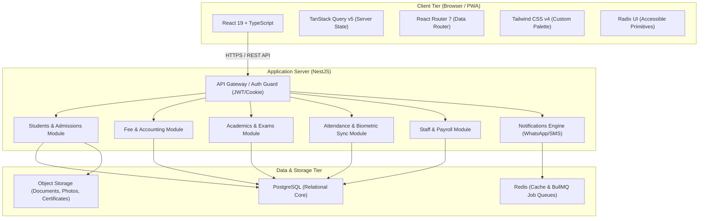

# Skooly ERP: Comprehensive Project Plan & Architecture

This document presents the strategic and technical project plan for **Skooly**, an all-in-one School ERP designed for a single school. It aligns product objectives, technological architecture, security compliance, and engineering guidelines.

---

## 1. Project Vision & Core Objectives

### The Problem
Traditional school management software is often fragmented into disconnected systems: spreadsheets for fees, standalone biometric software for attendance, manual registers for transport, and paper-based report cards. Generic multi-tenant SaaS tools introduce unnecessary complexity, confusing cross-tenant switches, and bloated pricing tiers.

### The Solution: Skooly
A streamlined, high-performance School ERP tailored to the daily realities of **one school**:
- **Speed & Density:** Fast navigation, minimal clicks, high information density designed for staff who keep the software open all day.
- **Unified Ledger:** Every student interaction (fees, exams, attendance, transport, disciplinary events) links to a single authoritative student profile.
- **Modern Architecture:** React 19 frontend paired with a modular NestJS + PostgreSQL backend.

---

## 2. Technology Stack & Architectural Decisions

### Frontend Specifications
- **Framework:** React 19, TypeScript 6 (`strict`, `noUncheckedIndexedAccess`).
- **Styling:** Tailwind CSS v4 via `@tailwindcss/vite`. Default Tailwind colors are explicitly disabled; all styling is driven by token variables defined in `DESIGN.md` (`canvas`, `surface`, `side`, `primary`, `accent`).
- **Data Fetching:** TanStack Query v5 with strict query key factories (`features/*/api/*Keys.ts`).
- **Form Handling:** React Hook Form + Zod 4 for runtime schema validation.
- **Routing:** React Router 7 with code-split lazy routes (`app/routes/*`).
- **Accessibility:** Radix UI primitives ensuring full keyboard navigation, ARIA attributes, and minimum 44px touch targets.

### Backend Specifications (Planned NestJS)
- **Framework:** NestJS (TypeScript, Fastify adapter for optimal throughput).
- **ORM & Database:** Prisma ORM or Drizzle ORM paired with PostgreSQL.
- **Authentication:** `httpOnly`, Secure, SameSite session cookies with Redis session store.
- **Queues & Jobs:** BullMQ with Redis for asynchronous tasks:
  - Bulk report card PDF rendering.
  - WhatsApp / SMS notification dispatches.
  - Automated fee payment reminders.
  - Nightly database snapshots.

---

## 3. Core Personas & Permissions Matrix

| Module Area | Admin | Registrar / Front Desk | Teacher | Accountant | Transport / Warden |
|---|---|---|---|---|---|
| **School Setup & Config** | Full | None | None | None | None |
| **Admissions & Student Records** | Full | Read/Write | Read Only | Read Only | View Assigned |
| **Attendance** | Full | View Class | Mark Class | View Reports | View Bus/Hostel |
| **Academics & Exams** | Full | View Records | Mark Entry / Plan | None | None |
| **Fees & Payments** | Full | View Status | None | Full Cashier | View Status |
| **Staff & Payroll** | Full | None | View Own | Process Payroll | View Own |
| **Transport & Fleet** | Full | None | None | View Fees | Manage Fleet |
| **System Audit & Backups** | Full | None | None | None | None |

---

## 4. Entity Relationship Overview (High-Level Data Model)

1. **Institutions & Calendar:**
   - `AcademicYear` (e.g. "2026-2027", current flag, start/end dates).
   - `Term` / `Semester` (links to `AcademicYear`).
   - `ClassGrade` (1 to 12) $\rightarrow$ `Section` (A, B, C) $\rightarrow$ `ClassTeacher`.
2. **Students & Households:**
   - `Student` (AdmissionNo, RollNo, Name, DOB, Category, CurrentSectionId).
   - `Guardian` (Name, Phone, Email, Relation, Address).
   - `StudentGuardian` (junction linking siblings to shared guardians).
3. **Financials:**
   - `FeeHead` (Tuition, Computer Lab, Annual Sports, Transport).
   - `FeeStructure` (ClassGradeId, TermId, AmountInPaise).
   - `FeeInvoice` (StudentId, DueDate, TotalAmount, DiscountAmount, Status: Paid/Partial/Unpaid).
   - `FeePayment` (InvoiceId, PaidAmount, PaymentMode, TransactionRef, ReceiptNo).
4. **Attendance:**
   - `AttendanceRecord` (StudentId, Date, PeriodNo, Status: Present/Absent/Late, Reason).
5. **Academics:**
   - `Subject` (Code, Name, Department).
   - `Exam` (TermId, ExamType, StartDate, EndDate).
   - `ExamMark` (StudentId, ExamId, SubjectId, MarksObtained, MaxMarks, Grade).

---

## 5. Security, Privacy & Integrity Standards

- **Zero Client-Side Business Authority:** The frontend never decides fee totals, pass/fail results, or user roles; every action is computed and authorized on the NestJS API.
- **Strict Data Validation:** Every network request passes through Zod schemas at the client boundary, rejecting malformed responses immediately.
- **Financial Precision:** All monetary amounts are recorded in integer minor units (paise in INR) to prevent IEEE 754 floating-point rounding errors.
- **Sensitive Data Handling:** PII (student medical records, parent contact details, employee salaries) is protected behind role-based guards.
- **Activity & Audit Logging:** Financial receipts, grade modifications, and admission status changes produce immutable audit trail records with timestamps and actor IDs.
